# Reactive Programming

> with webflux, coroutines, r2dbc

### Prepare

> The test will be conducted based on JMeter, with the number of threads set to 100 and the loop count set to 1000
> iterations.

### create

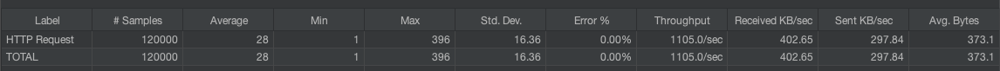
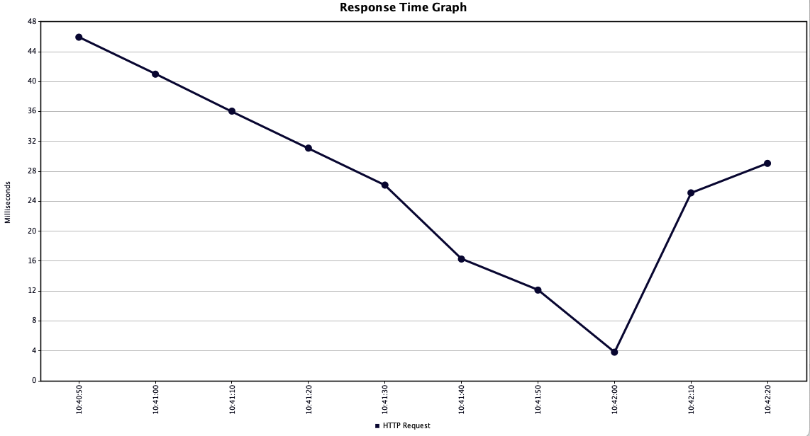
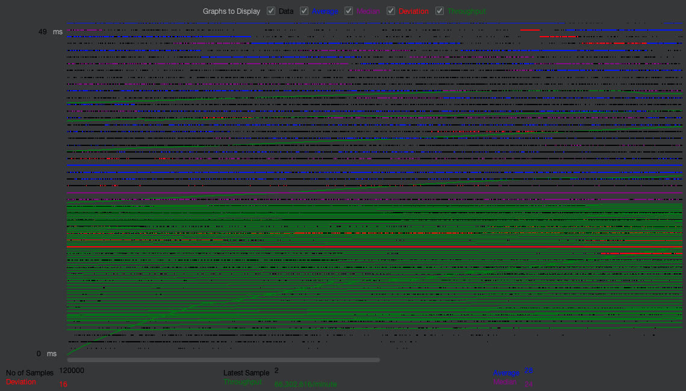
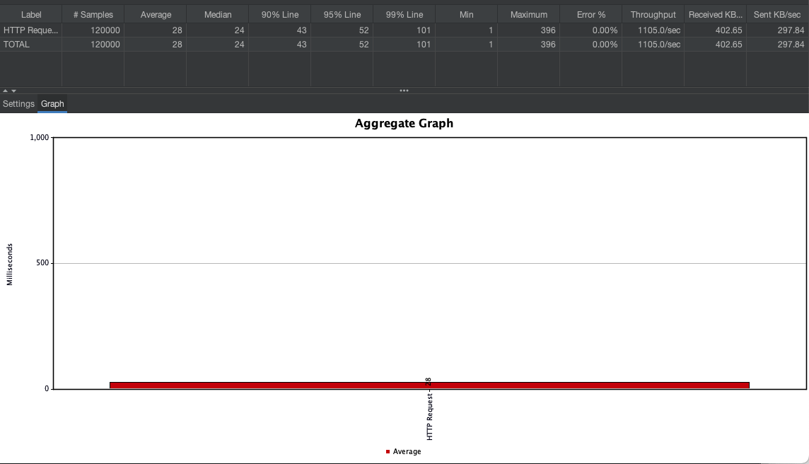

### get

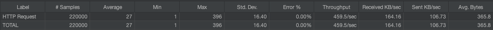
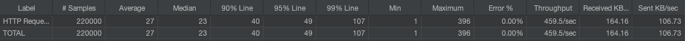
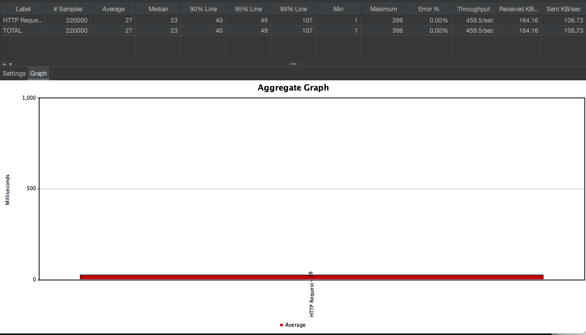
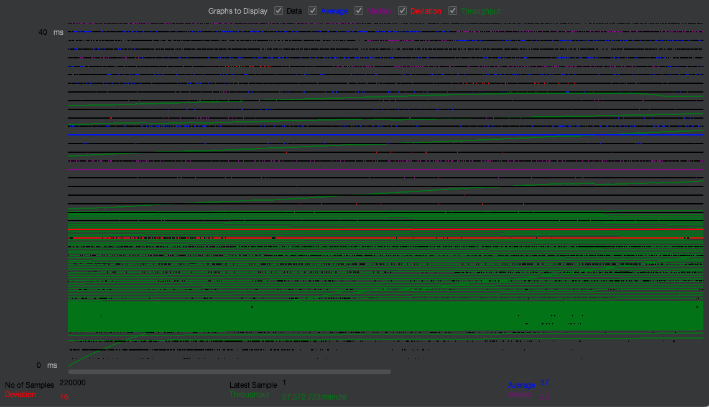

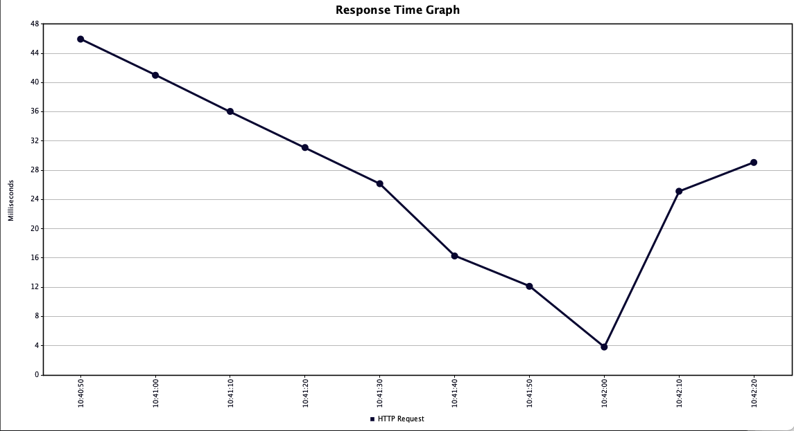

### search

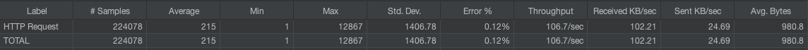
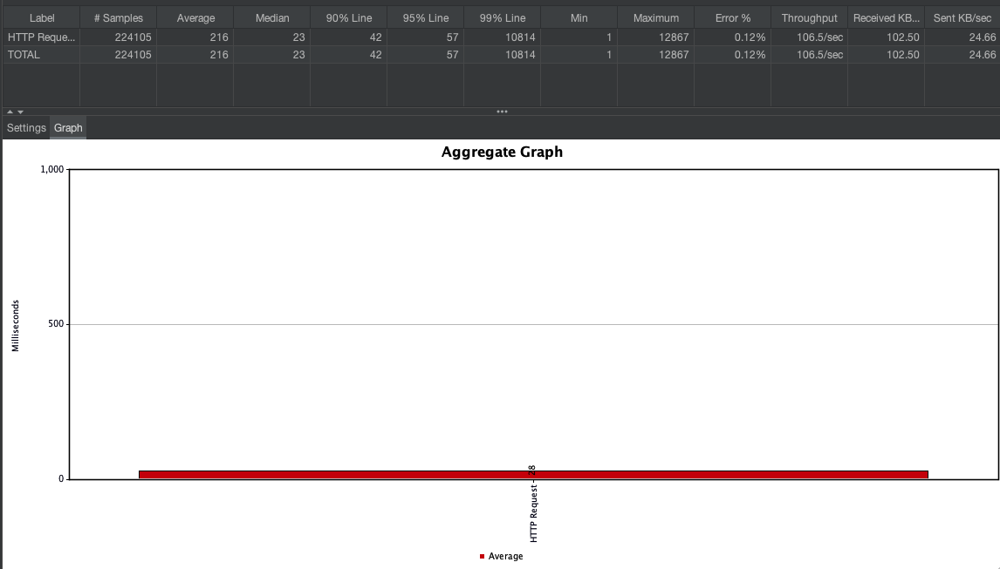
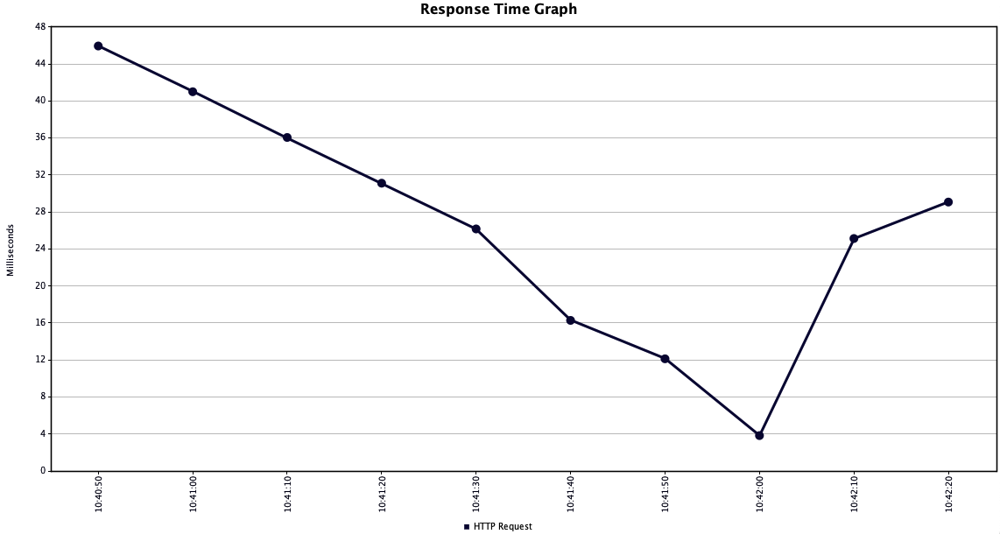
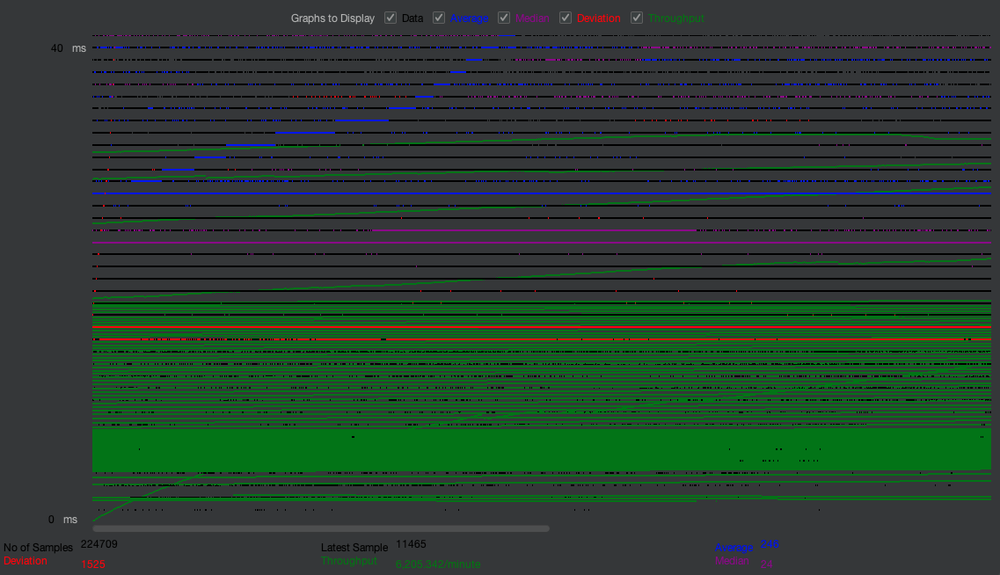
